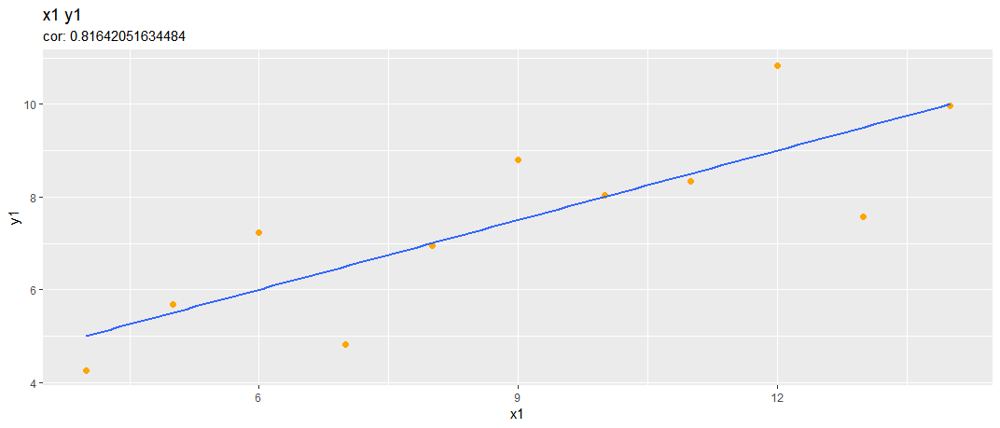
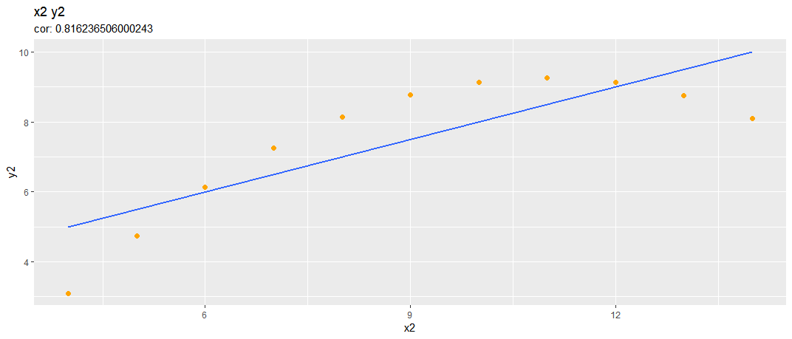
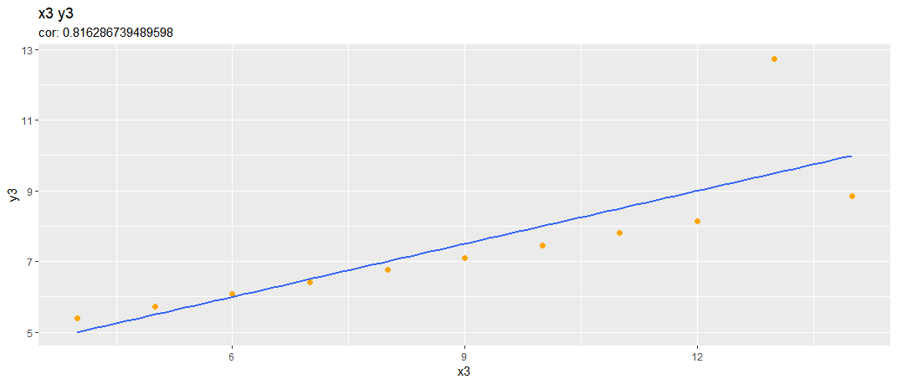
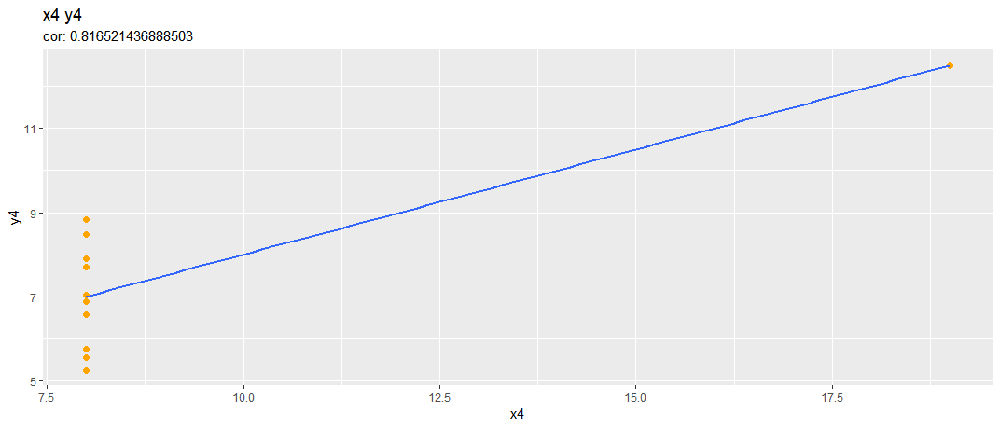
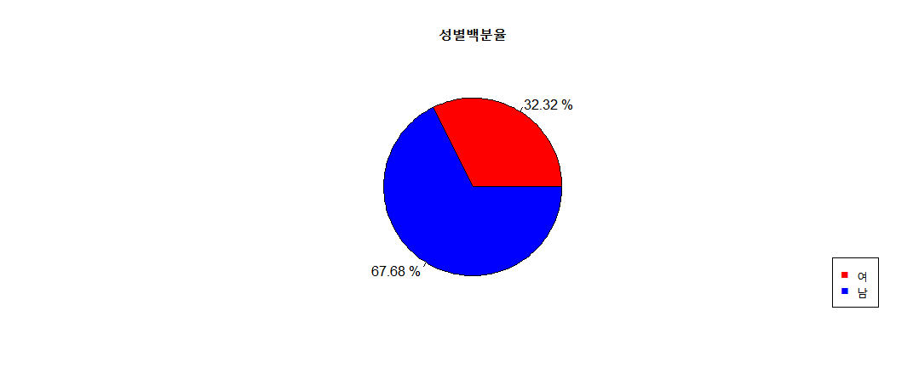
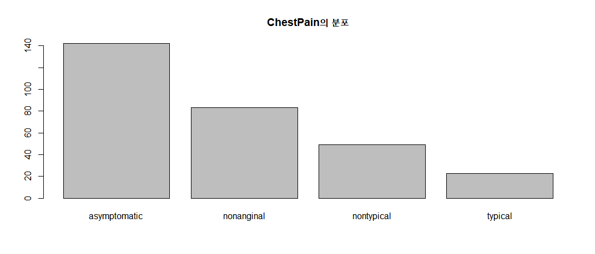
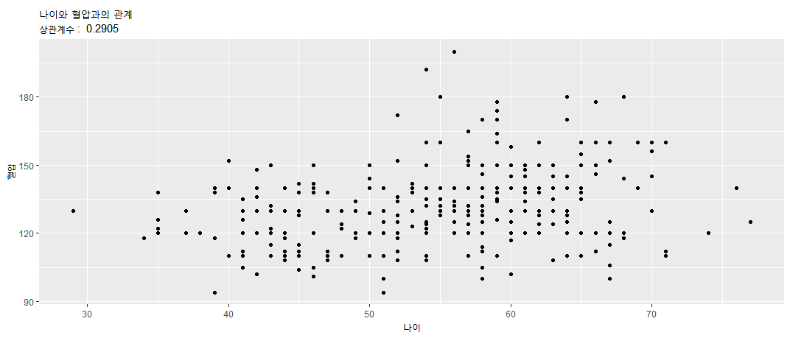
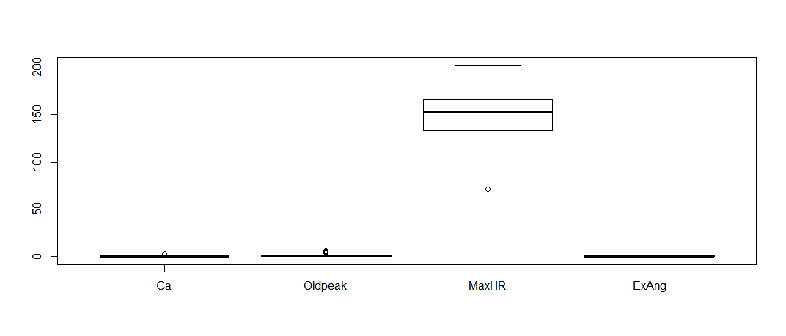

# 수량형 데이터 시각화 | Test11 12

##### 상관계수 (cor)만 보고 그래프 개형을 추측할 수 없음
##### 밑의 예제로 확인해보자
##### > cor확인 후 꼭 plot으로 확인!

## 실습 11
#### 1.Anscombe's quartet 데이터 시각화
```R
data(anscombe)
# 1. 상관계수 확인 : 0.816...으로 모두 같음
cor(anscombe[c(1:4)], anscombe[c(5:8)])
y1         y2         y3         y4
x1  0.8164205  0.8162365  0.8162867 -0.3140467
x2  0.8164205  0.8162365  0.8162867 -0.3140467
x3  0.8164205  0.8162365  0.8162867 -0.3140467
x4 -0.5290927 -0.7184365 -0.3446610  0.8165214

# 2. 그래프 개형 ggplot2
ggplot(anscombe,aes(x1,y1)) + geom_point(col="orange",size=2)+
  geom_smooth(method=lm,se=F) + labs(title="x1 y1", subtitle=paste("cor:",cor(anscombe$x1, anscombe$y1))) # se=F 추세선 == (회귀분석) 추세를 알수 있다 == 예측을위한 선
ggplot(anscombe,aes(x2,y2)) + geom_point(col="orange",size=2)+
  geom_smooth(method=lm,se=F) + labs(title="x2 y2", subtitle=paste("cor:",cor(anscombe$x2, anscombe$y2)))
ggplot(anscombe,aes(x3,y3)) + geom_point(col="orange",size=2)+
  geom_smooth(method=lm,se=F) + labs(title="x3 y3", subtitle=paste("cor:",cor(anscombe$x3, anscombe$y3)))
ggplot(anscombe,aes(x4,y4)) + geom_point(col="orange",size=2)+
  geom_smooth(method=lm,se=F) + labs(title="x4 y4", subtitle=paste("cor:",cor(anscombe$x4, anscombe$y4)))
```





#### 2. boston 데이터 시각화 (수량형 데이터)
> (1)Boston House Prices dataset 사용
 https://www.kaggle.com/에서 검색하여  데이터 특징 설명 및 파일 다운
 (2)데이터의  구조 확인
 (3)기초통계요약 확인
 (4)모든 특징들에 대한 상관계수 확인
 (5)주택가격(medv)과 다른 특징들과의  상관계수
 (6) rm,ptratio, lstat, medv 4개 특징만 사용
 (7)4 특징들에 대한 scatter plot (산점도 행렬 : Scatterplot Matrices)
 (8)4 특징들의 분포(histogram) 확인

```R
# 1. boston 데이터 시각화
boston = read.table("boston.txt", header = T, sep="", stringsAsFactors = F)

# 2. 데이터의 구조확인
str(boston)

# 3. 기초통계요약확인
summary(boston)

# 4. 모든 특징들에 대한 상관계수 확인
cor(boston)

# 5. 주택가격(medv)과 다른 특징들과의 상관계수
(medv_cor = cor(boston, boston$medv)) # 세로로
(medv_cor = cor(boston$medv, boston[,c(-14)])) # 가로로 > 추후 barplot을 위해 가로로 뽑는 것이 유리 > medv열은 제외하고
barplot(medv_cor)

# 6. rm ptratio, lstat, medv 4개 특징만 사용
boston4 = boston[c("rm","ptratio","lstat", "medv")] # 4개 특징만 추출하여 새로운 dataframe 만들기

# names설정필요없이 > 열 기준으로 정렬하면 됨
sorted_medv_cor = medv_cor[,order(abs(medv_cor), decreasing = "T")]
```


```R
# 7. 4특징들에 대한 scatter plot 산점도 행렬
pairs(boston4)

### ggplot 사용하면 이런식으로~
ggplot(boston4, aes(boston$medv, boston$rm)) +
  geom_point(aes(boston$medv, boston$rm))
```

```R
# 8. 4특징들의 분포확인 histgram
### medv와 상관계수 높은 상위 4개 특징 boxplot 만들기
boxplot(boston[,order(abs(medv_cor), decreasing = "T")][1:4])
###

oldpar = par(mfrow = c(2,2))

hist(boston$rm,freq = F)
lines(density(boston$rm))

hist(boston$ptratio,freq = F)
hist(boston$lstat,freq = F)

plot(density(boston$medv))

par(oldpar)
```


### 실습12
> Heart Disease UCI 분석
https://www.kaggle.com/ronitf/heart-disease-uci
Data Set Information:
심장질환의 유무를 판정하는 데이터집합
14개 특징
Age : 나이
Sex : 성별 (1 = male 0 = female)
ChestPain  : 흉통 유형(1 = 전형적인 협심증, 2 = 비정형 협심증, 3 = 비협심증 통, 4 : 무증상
(1: typical angina, 2: atypical angina, 3: non-anginal pain, 4: asymptomatic)
RestBP : 혈압 (resting blood pressure , mmHg)
Chol : 혈청 (cholestoral mg / dl)
Fbs :  공복 혈당 (> 120 mg / dl 이면 1, 아니면 0)
RestECG : 심전도 (0 : 정상, 1 :ST-T 파 이상, 2 :좌심실 비대)
MaxHR  : 최대 심박수
ExAng : 운동 유발 협심증 (1 = yes; 0 = no)
Oldpeak : ST 우울증
Slope : 최대 운동 ST의 기울기 (1: upsloping, 2: flat,  3: downsloping)
Ca: 주요혈관수 (0-3)
Thal :  3 = normal; 6 = fixed defect; 7 = reversable defect
AHD : 심장병 진단 결과 (혈관 조영 상태) No : 주요혈관 축소 50%미만, Yes:  주요혈관 축소 50%이상
> 1) Heart.csv 파일 열기
> 3) 데이터 타입들, 상하위 5개 데이터 확인
> 5) AHD 변경, No=0, Yes=1
> 5) AHD 변경, No=0, Yes=1
> 5) AHD 변경, No=0, Yes=1
> 6) 통계요약
> 7) 누락된 값 있는 행삭제
> 8) 나이의 histogram(분포 확인)
> 9) 성별에 대한 pie plot (백분율로 표시)
> 10) ChestPain 에 대한 카운트 bar chart
> 11) 나이와  최대심박수, 나이와 혈압과의 관계 확인 (상관계수, scatter plot)
> 12) 심장병(target(AHD))과 상관관계가 높은 속성중 4개만 선택하여 심장병과의 관계 분석 >  scatter_matrix()
> 13) 4개 특징의 분포 확인 (boxplot)
> 14) target(AHD)을 기준(groupby)으로 최대, 최소, 평균, 표준편차 계산

```R
# 1) Heart.csv 파일 열기
heart = read.csv('Heart.csv', header=T, stringsAsFactors = T)

# 3) 데이터 타입들, 상하위 5개 데이터 확인
str(heart)
head(heart)
tail(heart)
```

```R
# 5) AHD 변경, No=0, Yes=1
########### 방법1 ) ifelse를 이용하여 간편하게
heart$AHD = ifelse(heart$AHD=="Yes", 1, 0)
############# 방법2) factor > vector 변환 ->  which "yes" = 1 which "no" 0 -> as.numeric()으로 num변환

heart$AHD = as.vector(heart$AHD) # 먼저 string > vector로 풀어주기 // 왜? which사용시 'na'값 저장됨
which(heart$AHD=="Yes") # "Yes"인 행 번호 가져오기
heart[which(heart$AHD=="Yes"), c("AHD")] = 1 # 가져온 행 번호 기준, heart의 AHD열 데이터만 접근 Yes=1
heart[which(heart$AHD=="No"), c("AHD")] = 0 # No=0
heart$AHD = as.numeric(heart$AHD) # 위에서 0 . 1이 char형이라 factor로 바꾸기전 int형으로 바꾸려고 했지만
######################

heart$AHD = as.factor(heart$AHD) # 어차피 factor는 String으로 바뀜 (형 변환 필요 x)
```
```R
# 6) 통계요약
summary(heart)

# 7) 누락된 값 있는 행 삭제
heart = na.omit(heart)
```
```R
# 8) 나이의 histgram 분포확인
hist(heart$Age, freq=F)
lines(density(heart$Age))
```

```R
# 9) 성별에 대한 pieplot(백분율 표시)  성별 (1 = male 0 = female)
table(heart$Sex) # table을 이용하여 개수구하기
sum(table(heart$Sex)) # 총 개수
table(heart$Sex)/ sum(table(heart$Sex)) # 백분율 table

# 백분율 구하기

piedata = round(table(heart$Sex)/ sum(table(heart$Sex))*100, 2)
piedata = paste(piedata, "%")

pie(table(heart$Sex), label=piedata, col=c("red", "blue"), main = "성별백분율")
legend("bottomright", legend=c("여","남"), col=c("red","blue"), pch = "■")
```

###### 참고
```R
# pie에 데이터 넣을시 named 작업해주면 label설정 필요 x
sex_count = table(heart$Sex) # 1 male 0 female
sum_sex = sum(sex_count)# 총 인원
sex_ratio = round(sex_count / sum_sex * 100, 2) # 비율구하기 소수점 2자리까지

# pie에 데이터 넣기 전 name작업
names(sex_count) = sex_ratio

# pie에 넣기
pie(sex_count)

##### named num 벡터설정방법 ######
a = c("male"=3, "female"=2)
names(a) = c("a","b") # 이렇게 이름 바꿀수 있음
```

```R
# 10) ChestPain에 대한 카운트 barChart
barplot(table(heart$ChestPain), main = "ChestPain의 분포") # 꼭 테이블 이용하기! y축이 개수가 됨
```


```R
# 11) 나이와 최대심박수, 나이와 혈압과의 관계확인(상관계수, scatter plot)
cor_heart_MaxHR = cor(heart$Age, heart$MaxHR)
plot(heart$Age, heart$MaxHR, main = "나이와 최대심박수의 관계", xlab = "", ylab ="")
title(xlab = "나이", ylab ="최대심박수", sub = paste("상관계수: ", round(cor_heart_MaxHR,4)))
# paste ("@", 변수, "@") > 문자열 붙이기

# ggplot으로 그리기
cor_heart_RestBP = cor(heart$Age, heart$RestBP)
ggplot(heart, aes(heart$Age, heart$RestBP)) +
  geom_point() + labs(title = "나이와 혈압과의 관계", x = "나이", y="혈압", subtitle=paste("상관계수 : ", round(cor_heart_RestBP,4)))
```


```R
# 12) 심장병과 상관관계가 높은 속성중 4개만 선택하여 심장병과의 관계분석 scatter_matrix()
##### 만약 factor형이라면 > 바로 numeric x >> vector -> numeric
heart$AHD = as.vector(heart$AHD)
heart$AHD = as.numeric(heart$AHD)
##########
# 심장병 기준 모든 특징의 상관관계 구하기 (factor들은 제외 only 수치형)
num_heart = heart[,c(-3, -13)] # only 수치형 데이터만 정제 -> 나중에 정제된 frame기준으로 order할 것이므로 변수로 저장
cor_heart = cor(heart$AHD, num_heart) # 심장병 기준 cor

cor_heart[1,order(abs(cor_heart), decreasing = T)] # 수치확인
heart4 = num_heart[order(abs(cor_heart), decreasing = T)][2:5]
heart4 # top4 추출

pairs(heart4)

# 13) 4개의 특징의 분포확인
boxplot(heart4)
```

```R
# 14) target(AHD)를 기준으로 최대 최소 평균 표준편차 계산
aggregate(num_heart[-12], list(AHD_MAX = num_heart$AHD), max)
aggregate(num_heart[-12], list(AHD_MAX = num_heart$AHD), min)
aggregate(num_heart[-12], list(AHD_MAX = num_heart$AHD), mean)
aggregate(num_heart[-12], list(AHD_MAX = num_heart$AHD), sd)
```
