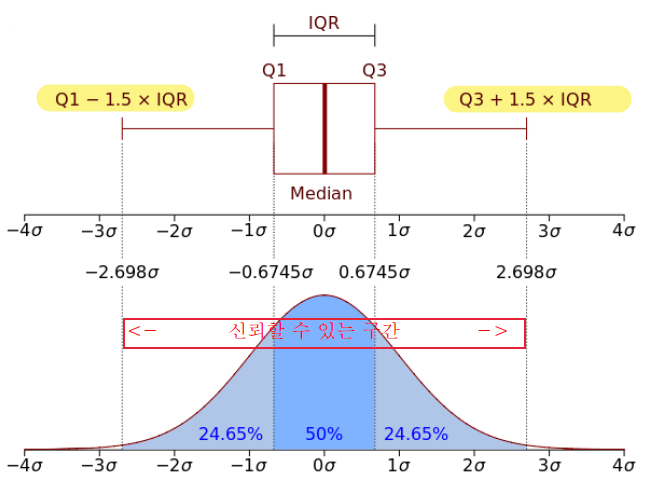
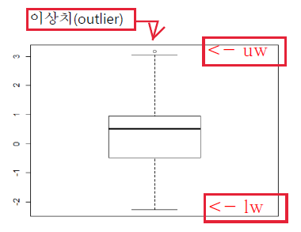
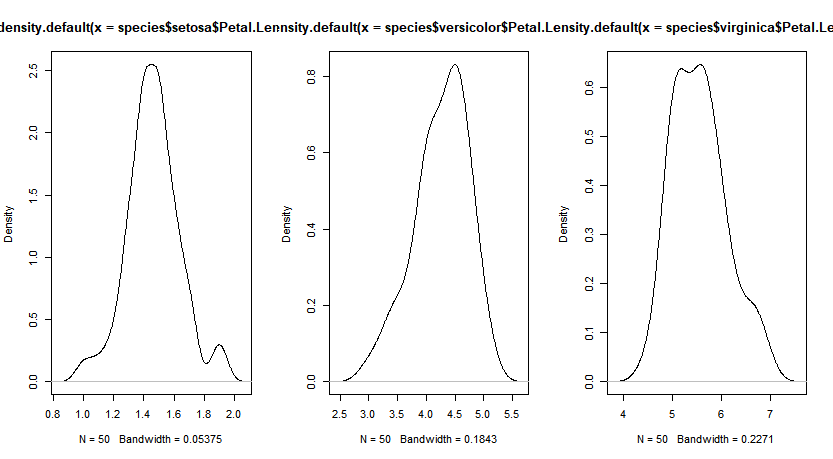
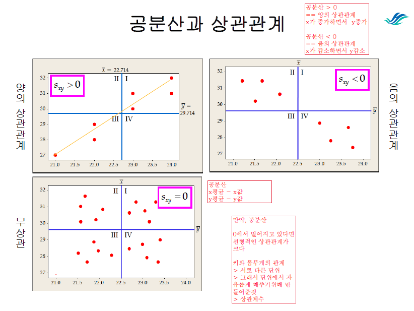
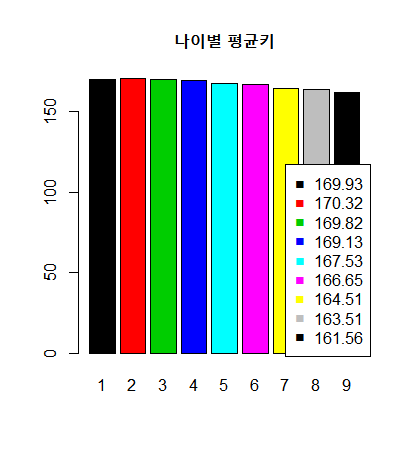
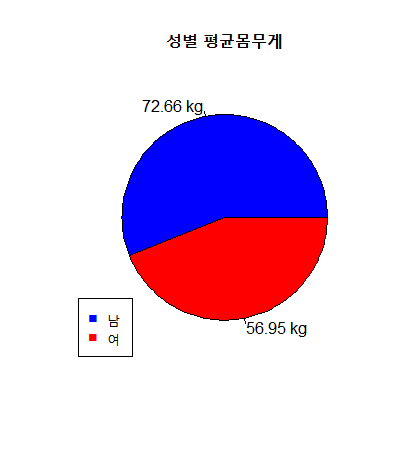
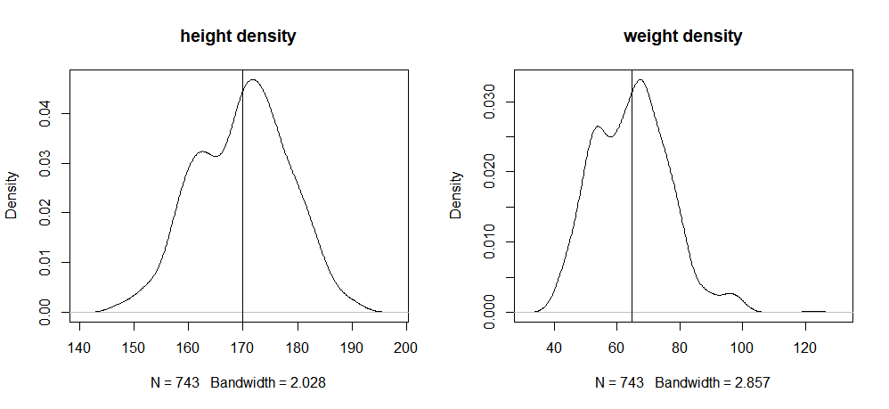
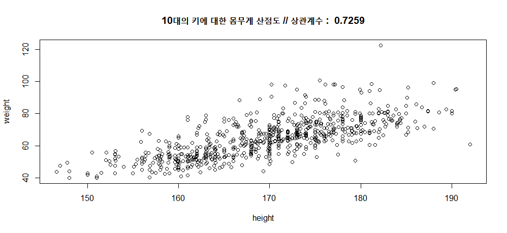
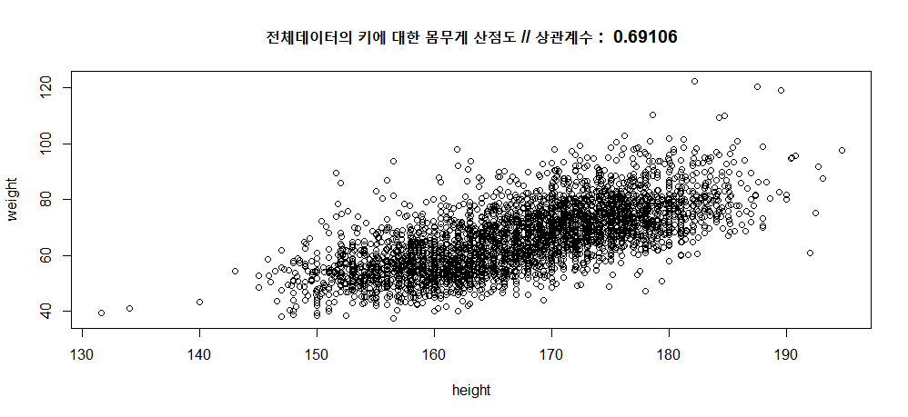
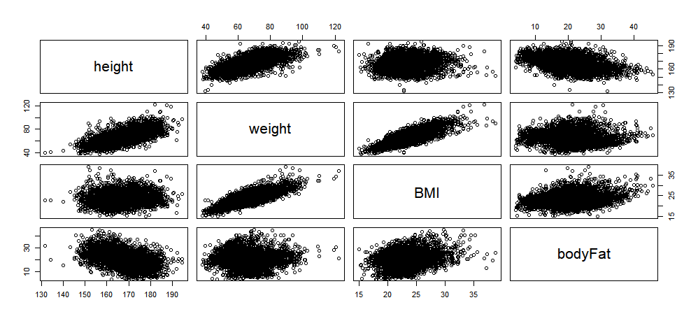

# 기술통계 | Test13, 14

### 1. 탐색적 데이터분석
#### 수집된 데이터로부터 데이터가 표현하는 현상을 이해나는 과정

### 2. 기술통계
#### 정의
>측정된 데이터를 사용하여 그래프로 전체자료의 모양을 확인하거나 숫자를 이용하여 데이터중심이나 퍼짐정도 등의 데이터의 특성을 설명하는 통계방법

#### 데이터 특성을 확인하는 요약통계지표
- 데이터의 중심 : 평균(mean) 중앙값 (median) 최빈값(mode)
- 데이터의 분산도 : 범위(range min~max), 분산(variance), 사분위수(quantile)

- 다섯수치요약(summary)
최소값, 제1사분위수, 중앙값, 제3사분위수, 최대값
```R
> summary(iris)
  Sepal.Length
 Min.   :4.300
 1st Qu.:5.100
 Median :5.800
 Mean   :5.843
 3rd Qu.:6.400
 Max.   :7.900   
```

- 최빈값 : 자료중 빈도수가 가장많은 값
table() -> which.max()로 색인검색

### 3. 산포도
#### 산포도
> 자료들이 얼마나 퍼져있는 가
(퍼져있을 경우 중심값이 비신뢰적)
#### 표준편차 = 분산의 제곱근
> 각 자료들이 평균에 대해서 평균적으로 얼마나 떨어져 있는지 측정

#### 분산
>편차 제곱의 평균

### 4. 사분위수
#### 범위 = 측정값의 범위
> max(x) - min(x)

#### 사분위
> 측정값 크기순으로 나열
1사분위수(Q1) : 1/4지점(25%)
2사분위수(Q2) : 2/4지점(50%)
3사분위수(Q3) : 3/4지점(75%)

#### 사분위범위
> IQR = Q3 - Q1


```R
mode = which.max(table(x)) # 최빈값
q1 = quantile(x, probs=0.25) # 1사분위
q3 = quantile(x, 3/4) # 3사분위
iqr = q3-q1 # 사분위 범위
# 이상값 < lw ~ uw > 이상값
lw = q1 - 1.5*iqr # lowerwhisper
uw = q3 + 1.5*iqr # upperwhisper
```

### 5. 이상치(outliers)
> 정상범위에서 벗어난 측정값
> Boxplot , lw보다 작고 uw 큰값


```R
# scatter plot에서 이상치 표시하는 방법
out = boxplot.stats(x)$out # 이상값확인
outi = which(x %in% out) # x가 out에 속한경우 위치값 반환
points(outi, out, pch = "V", col="red") # 위치기준 이상값으로 points
```

## 실습13
>iris 데이터를 이용하여 기술 통계값을 확인
(1)iris의 종별 최소값, 최대값, 평균, 중간값, 표준편차
(2)각 종(setosa", "versicolor","virginica") 에 대한 Petal.Length의 밀도함수
(3) 각 종(setosa", "versicolor","virginica") 에 대한 Petal.Length의  box plot
(4)setosa의 Petal.Length에 대한 1사분위, 3사분위, IRQ, lower whisker, upper whisker , 최빈값
(5)setosa의 Petal.Length에 대한 boxplot , , boxplot.status 로 outlier 확인
(6)setosa의 Petal.Length에 대한 lower whisker, upper whisker로 outlier  확인
(7)setosa의 Petal.Length에 대한 outlier , plot에서 표시

```R
# 1) iris의 종별 최소값, 최대값, 평균, 중간값, 표준편차
aggregate(iris[,c(-5)], list(iris$Species), min)
aggregate(iris[,c(-5)], list(iris$Species), max)
aggregate(iris[,c(-5)], list(iris$Species), mean)
aggregate(iris[,c(-5)], list(iris$Species), median)
aggregate(iris[,c(-5)], list(iris$Species), sd)
```
```R
# 2) 각 종에 대한 Petal.Length의 밀도함수
species = split(iris, iris$Species)
oldpar=par(mfrow=c(1,3))
plot(density(species$setosa$Petal.Length))
plot(density(species$versicolor$Petal.Length))
plot(density(species$virginica$Petal.Length))
par(oldpar)
```

```R
# 3) 각 종에대한 Petal.Length boxplot
with(species,
     {boxplot(setosa$Petal.Length, versicolor$Petal.Length, virginica$Petal.Length
              ,names = names(species), main = "각 종별 Petal.Length")
     })
```

```R
# 4) setosa의 Petal.Length에 대한 1사분위, 3사분위, IQR,lw, uw, 최빈값
setosa = species$setosa # 편하게 작성하기 위해 setosa만 추출
q1 = quantile(setosa$Petal.Length, probs = 0.25) # 1사분위
q3 = quantile(setosa$Petal.Length, 3/4) # 3사분위
iqr = q3-q1 # IQR > 추후 이상값 계산
lw = q1 - 1.5*iqr # Lower whisper
uw = q3 + 1.5*iqr # Upper whisper
mode = table(setosa$Petal.Length)[which.max(table(setosa$Petal.Length))] # 최빈값
mode = as.numeric(names(mode)) # table > which.max로 검색된 색인가져오기

> cat("<setosa$Petal.Length> \n q1 : ", q1, "\n q3 :", q3, "\n iqr :", iqr, "\n lw :", lw, "\n uw :", uw, "\n mode :", mode )
<setosa$Petal.Length>
 q1 :  1.4
 q3 : 1.575
 iqr : 0.175
 lw : 1.1375
 uw : 1.8375
 mode : 1.4
```

```R
# 5) setosa의 Petal.Length.에 대한 boxplot, boxplot.stats로 outlier확인
out = boxplot.stats(setosa$Petal.Length)$out # outlier값 > 추후 y

> out
[1] 1

outi = which(setosa$Petal.Length %in% out) # outlier값을 갖는 위치찾기  > 추후 x

> outi
[1] 23


# 6) setosa의 Petal.Length에 대한 lw, uw로 outlier확인
outx = which(setosa$Petal.Length < lw | setosa$Petal.Length > uw)
outy = (setosa$Petal.Length)[outx]

> (outy)
[1] 1.1 1.0 1.9 1.9
> (outy)
[1] 1.1 1.0 1.9 1.9
```

```R

# 7) outlier plot에 표시
# boxplot이용
plot(setosa$Petal.Length, main = "setosa$Petal.Lenth의 Outlier표시")
points(outi, out, pch = "V", col = c("red"))

# 직접계산이용
points(outx, outy, pch = "*", col = c("blue"))

```


### 6. 변동계수
> 평균을 중심으로 한 상대적인 산포의 척도

#### 표본의 변동계수
- 평균에 대한 표본편차의 비율
- 변동계수 ↑ == 산포도 ↑

#### 어디서사용해?
- 측정단위 동일 but 평균 큰차이를 보이는 두 자료집단
ex) 신생아의 몸무게와 산모의 몸무게 <br><br>

- 측정단위 불일치
ex) 키와 몸무게

### 7. 두 자료의 선형적 상관관계
#### 산점도 (Scatter plot)
 - 두 변수를 x,y 좌표로 그린그림
 - x = 입력변수 / y = 출력변수
 - 점들이 얼만큼 모여있는가
 - 선형관계를 시작화로 보는 방법
#### 공분산
 - 두 변수사이의 관계에 대한 형태, 방향, 밀접관계의 강도 등 확인할 수 있는 값
 - 회귀직선 = 두 변수로 그려진 산포도에서 데이터 점에 적합한 선
 - 회귀직선에 데이터 점 가까움 == 선형적관계↑

 #### 표본의 공분산
 - 입력변수의 평균편차와 출력변수의 평균편차의 곱을 n-1로 나눈값


###8. 상관계수
#### 상관계수
- 두 변수 사이의 선형적인 상관관계
- 범위 -1 ~ 1
- 0에 가까울수록 약함 / 1 or -1에 가까울수록 강함

#### 표본상관계수(cor)
- 표본의 공분산을 두 자료집단의 표준편차의 곱으로 나눈 값
- 공분산은 서로 같은 단위를 가져야 했지만
- 단위에서 자유롭게 해준 상관계수를 사용!
- 하지만 반드시 선형관계에서만 유효
- 비선형적인 관계는 상관계수로 해석불가, 왜? outlier 에 민감
- 만약 사용하고 싶다면 이상치 제거작업 필수

## 실습14
>physicalfitness.txt을 이용하여 다음을 해결하여 제출하세요
(1) 나이그룹별 평균키에 대한 막대그래프
(2) 성별에 대한 평균몸무게 원그래프
(3)10대의 키와 몸무게에 대한 평균, 표준편차, 변동계수를 확인
(4)10대의  키와 몸무게에 대한  산점도(scater plot)와 상관계수 확인
(산점도 주제목에 상관계수 표시)
(5)전체 데이터의  키와 몸무게에 대한  산점도와 상관계수 확인
(산점도 주제목에 상관계수 표시)
(6)전체 데이터의  몸무게와 BMI에 대한  산점도와 상관계수 확인
(산점도 주제목에 상관계수 표시)
(7)height weight BMI bodyFat에 대한  산점도 행렬 그리기

```R
py = read.table("physicalFitness.txt", sep = ",", header = T, skip = 3)
```

```R
#1) 나이그룹별 평균키에 대한 막대그래프
# 나이 vector > factor
py$ageGroup = as.factor(py$ageGroup)
# 그룹별 평균키
age_height_mean = tapply(py$height, py$ageGroup, mean)
barplot(age_height_mean, main = "나이별 평균키", col = c(1:9))
legend("bottomright", legend = round(age_height_mean,2), pch = "■", col = c(1:9))
```


```R
#2) 성별에 대한 평균몸무게 원그래프
py$sex = as.factor(py$sex)
# 성별 평균몸무게
sex_weight_mean = tapply(py$weight, py$sex, mean)
pie(sex_weight_mean, label = paste(round(sex_weight_mean, 2), "kg"), col = c("blue", "red"), main = "성별 평균몸무게")
legend("bottomleft", legend=c("남", "여"), col=c("blue","red"), pch = "■")
```


```R
#3) 10대의 키와 몸무게에 대한 평균, 표준편차, 변동계수를 확인
# 10대만 추출
ag = split(py, py$ageGroup)
teens = ag$"1"
# 변동계수 확인을 위해 평균, 표준편차 구함
# 단위가 다른 두 자료집단에 대한 산포의 척도를 비교하기 위해 변동계수 확인
# 변동계수 ↑ == 산포도 ↑ == 평균을 중심으로 많이 흩어져있다. 평균을 중심으로 데이터의 퍼짐정도가 크다

teens[,c("weight", "height")]
teens_mean= apply(teens[,c("weight", "height")], 2, mean)
> teens_mean  # 평균
  weight    height
  64.75626 169.93405

teens_sd = apply(teens[,c("weight", "height")], 2, sd)
> teens_sd
  weight   height # 표준편차
  11.90726  8.45416

teens_cv = teens_sd / teens_mean * 100 # 평균에 대한 표본편차의 비율

> teens_cv # 변동계수 : height 가 평균을 중심으로 더 모여있다.
  weight    height
  18.387815  4.974965
```

```R
####### 그래프 비교 < 위 그래프 코드 > ###### // 안봐도 됨
oldpar = par(mfrow=c(1,2))
plot(density(teens$height), main = "height density")
abline(v = mean(teens$height))

plot(density(teens$weight), main = "weight density")
abline(v=mean(teens$weight))

par(oldpar)

plot(teens$height, teens$weight)
abline(v=mean(teens$height),h = mean(teens$weight))
###### 안봐도 됨 ########
```

```R
#4) 10대의 키와 몸무게에 대한 산점도와 상관계수 확인
with(teens,{
  teens_cor_hw = cor(height, weight)
  plot(height, weight, main =paste("10대의 키에 대한 몸무게 산점도 // 상관계수 : ",round(teens_cor_hw, 5)))
})
```


```R
#5) 전체 데이터의 키와 몸무게에 대한 산점도와 상관계수 확인
with(py,{
  py_cor_hw = cor(height, weight)
  plot(height, weight, main =paste("전체데이터의 키에 대한 몸무게 산점도 // 상관계수 : ",round(py_cor_hw, 5)))
})
```


```R
#6) 전체 데이터의 몸무게와 BMI에 대한 산점도와 상관계수 확인
with(py,{
  py_cor_wb = cor(weight, BMI)
  plot(weight, BMI, main =paste("전체데이터의 몸무게에 대한 BMI 산점도 // 상관계수 : ", round(py_cor_wb, 5)))
})
```


```R
#7) height weight BMI bodyFat 에 대한 산점도 행렬
pairs(py[,c(-1,-2)])
```

