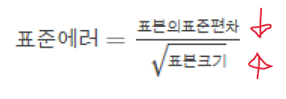
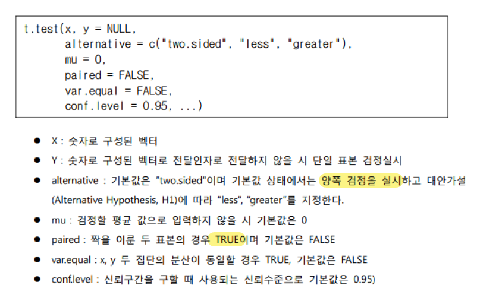

# 통계분석 Test15

### 통계적 추론
#### 정의
> 주어진 현상에 대한 가정과 데이터를 사용해 통계적 모델을 만들어 다양한 결론을 도출해 내는 과정

- 통계이론을 바탕으로 현상을 일반화
- 표본(제한된관찰)을 기반으로 모집단(표본데이터가 대표하는현상)에 대한 일반적인 결론유도
- 제한된 관찰을 일반화 > 불확실성 수반
- 통계적 추론기법을 이용해 불확실성 계량화
  + 신뢰구간 : 표본이 추출된 대상이 되는 모집단의 평균값이 어떤 범위에 존재 할 수 있는지 계산
  + 가설검정 : 실험 데이터에서 두 집단 사이의 측정값에 차이가 관찰 -> 통계적추론으로 이 차이가 의미가 있는 것인지 확인가능

### 통계적 추론의 기법
#### 모수적 방법
> 특정한 확률분포를 가정하고, 해당 분포의 평균과 분산을 추정

 - 표본의 확률분포를 알고 있음 or 추측할 수 있다고 가정
 - 모집단의 특징을 추정
#### 비모수적 방법
> 원래 표본에서 복원 재추출을 통해 표본분포를 생성

 - 주어진 표본은 모집단이라 가정
 - 복원추출을 통해 표본분포 생성(복원추출 : 한번뽑은 것 다시 뽑을 수 있음)

### 모수적방법
#### 중심극한정리
> 표본의 크기가 커질수록 표본 평균의 분포는 모집단의 분포 모양과는 관계없이 정규 분포에 가까워진다.

- 이때 표본분포의 표본 평균 = 모집단의 모 평균
- 표본 표준 편차 = 모집단의 모 표준 편차 / 표본 크기의 제곱근

#### 표본분포
- 표본 평균의 분포

#### 표준에러
- 표본분포의 표준편차 (표본의 표준편차와 구분)
- 표본추출에 의한 추정치와 모집단의 평균간의 거리를 나타내는 지표로 측정의 정확도 표현
- 표본의 크기 ↑ = 표준에러 ↓

### 비모수적방법 : 표본 채추출법
- 표본재추출법, 부트스트래핑
- 주어진 표본 모집단으로 가정
- 여기서 표본을 여러번 추출, 표본분포를 직접만듬

### 신뢰구간
- 통계적 추론의 가장 기본적인 작업 = 모집단의 통계값 추정
- 제한된 표본에 근거한 추정 -> 오류의 가능성 수반 -> 오류의 정도를 수치화 한 것
- 모집단의 평균값을 어떤 특정한 신뢰도(95%) 이상의 확률로 표함할 거으로 추정되는 구간
- 신뢰구간의 범위 ↓ = 더 정확한 측정값
##### 신뢰구간 = 표본평균 +- 신뢰도상수 * 표준에러
###### 신뢰도상수 : 95% = 1.96 / 99% = 2.58

- 표쥰에러가 작으면 신뢰구간의 범위가 줄어듬 > 즉, 더 정확한 측정값 도출 가능

##### 표준에러 = 표본의표준편차 / 표본크기
###### 표준편차가 작을수록 / 표본크기가 클수록 신뢰구간 좁히기


### 가설검정
#### 정의
- 분석의 목적은 어떤 명제에 대한 참/거짓 여부를 가리는 것
- 주어진 데이터를 통해 검증되기 전까지는 <가설>

- 데이터를 통해 주어진 명제의 진위를 밝히는 일
- 신뢰구간 = 추정된 값의 정확도를 밝히는 작업
- 가설검정 = 주어진 데이터가 가설을 얼마나 뒷받침하는지
#### 명제
- 관심을 가지는 검정통계값(test statistic)에 대한 조건
ex) 가설 : 어떤 집단에 속하는 학생들의 성적이 특정 기준치에 대해서 높거나 낮다.
사용할 수 있는 통계값 :
  + 해당 집단의 학생성적의 평균
  + 두 집단의 학생의 성적 비교 시 두 학생 집단의 평균성적 차이

#### 대립가설 귀무가설
- 정의한 통계값에 대한 다양한 가설이 주어진 데이터에 의해서 얼마나 지지되는지 평가
##### ◈ 대립가설 : 증명하고자 하는 명제
###### "서로 평균이 다르다" 라는 것을 증명
##### ◈ 귀무가설 : 부정하려는 명제
###### "서로 평균이 같다" 라는 것을 증명

<예> 두 집단 비교 (평균의 차이로 의미분석)
- 대립가설 : 두 집단의 평균에 유의미한 차이가 있음
- 귀무가설 : 두 집단의 평균에 유의미한 차이가 없음


### t-test
#### one sample t-test : 단일표본의 모평균 가설검정
#### two sample t-test : 서로 독립인 두 표본에서의 평균비교 가설검정

#### paired sample t-test : 짝을 이룬 표본에 대한 평균 차이에 대한 추정과 검정 : t.test(paired=TRUE)
```R
with(sleep,{
  t.test(extra[group==1], extra[group==2], paired=T,
         conf.level = 0.95)

})
```
```R
##
##  Paired t-test
##
## data:  extra[group == 1] and extra[group == 2]
## t = -4.0621, df = 9, p-value = 0.002833
## alternative hypothesis: true difference in means is not equal to 0
## 95 percent confidence interval:
##  -2.4598858 -0.7001142
## sample estimates:
## mean of the differences
##                   -1.58
```
대립가설 : group1과 group2의 수면시간 증감효과에 차이가 있다.
귀무가설 : group1과 group2의 수면시간 증감효과에 차이가 없다.

- paired=T : 짝을 이루는 데이터
- p-value < 0.05로 귀무가설 기각, 대립가설 채택
- 신뢰구간 -2.4598858 ~ -0.7001142 : 모집단으로부터 뽑은 표본들의 평균의 차이가 0이 포함되어있지 않음 > 모집단으로부터 추출한 표본들의 평균의 차이는 위 구간에서만 허용 > 대립가설의 이유
- group1과 2의 평균차이 : -1.58

즉, group1과 group2의 수면시간 증감효과에 차이가 있다

#### Sleep 데이터의 그룹별 데이터 통계분석
> – 각 그룹별 데이터가 수면시간(extra)에 대해 효과가 있는가에 대한 검정(유의수준 5%)

```R
t.test(sleep$extra[sleep$group==1])
```

```R
##
##  One Sample t-test
##
## data:  sleep$extra[sleep$group == 1]
## t = 1.3257, df = 9, p-value = 0.2176
## alternative hypothesis: true mean is not equal to 0
## 95 percent confidence interval:
##  -0.5297804  2.0297804
## sample estimates:
## mean of x
##      0.75
```
대립가설 : group1이 수면시간 증감에 효과가 있다. (증감이 0이 아니다)
귀무가설 : group1이 수면시간 증감에 효과가 없다. (증감이 0이 이다)

- p-value > 0.05 로 귀무가설 기각불가, 귀무가설 채택
- 신뢰구간 -0.5297804  ~ 2.0297804 : 모집단으로터 뽑은 표본들의 평균이 0을 포함하고 있음 > 귀무가설의 이유
- group1 평균 : 0.75

즉, group1의 수면제는 수면시간 증감효과가 없다.

```R
t.test(sleep$extra[sleep$group==2])
```
```R
##
##  One Sample t-test
##
## data:  sleep$extra[sleep$group == 2]
## t = 3.6799, df = 9, p-value = 0.005076
## alternative hypothesis: true mean is not equal to 0
## 95 percent confidence interval:
##  0.8976775 3.7623225
## sample estimates:
## mean of x
##      2.33
```
대립가설 : group2가 수면시간 증감에 효과가 있다. (증감이 0이 아니다)
귀무가설 : group2가 수면시간 증감에 효과가 없다. (증감이 0이 이다)

- p-value < 0.05 이므로 귀무가설 기각, 대립가설 채택
- 신뢰구간 0.8976775 ~ 3.7623225 : 95% 신뢰성으로 추정한 모평균의 범위 : 모집단으로부터 뽑은 표본들의 평균이 0을 포함하고 있지 않음> 대립가설의 이유
- group2 평균 : 2.33

즉, group2의 수면제는 수면시간에 증감효과가 있다.
