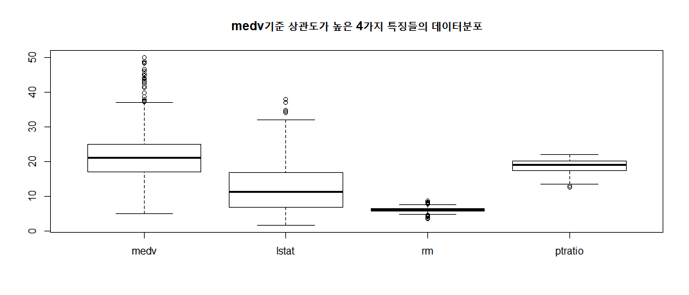
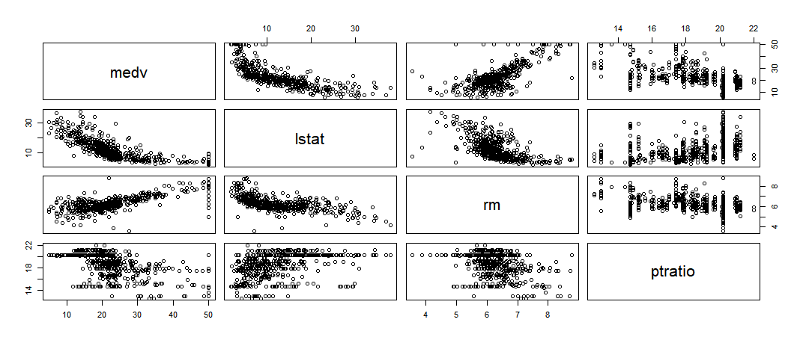
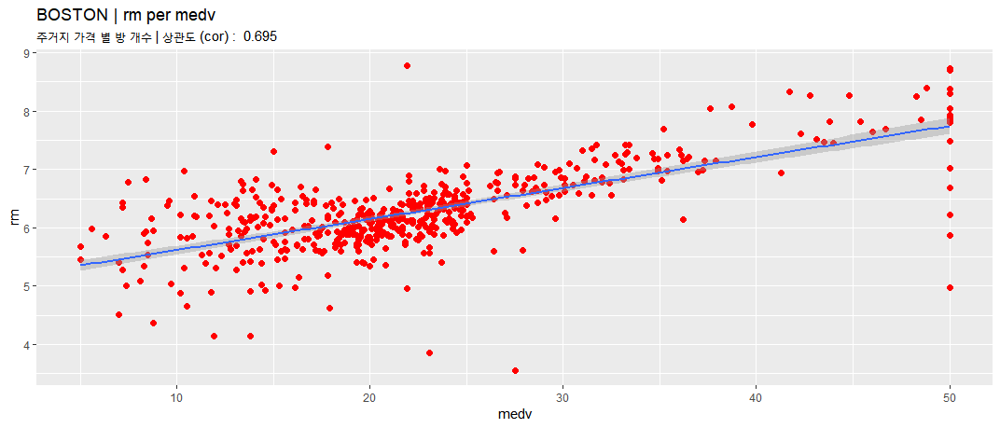
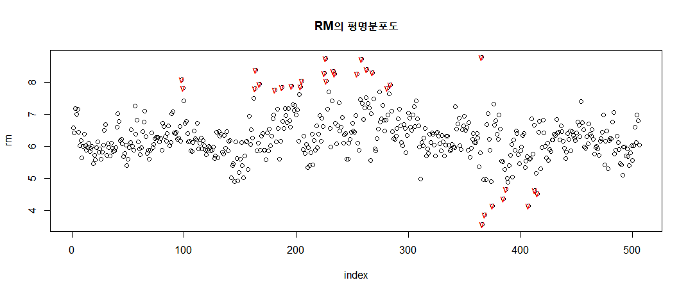
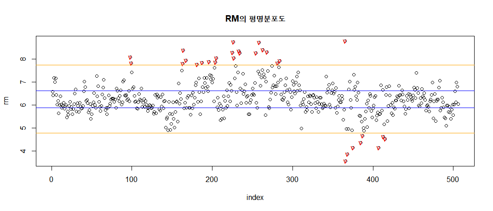
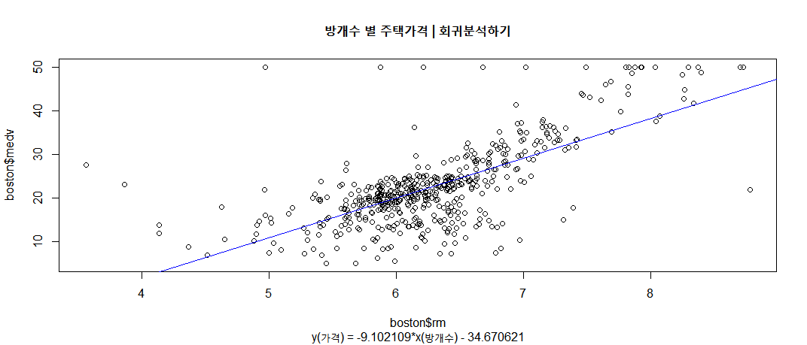
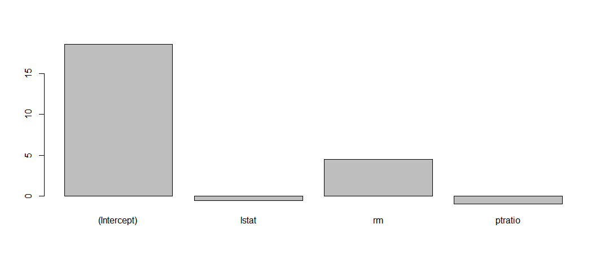

# FinalTest를 위한 정리
### Boston <시각화 부터 이상치 체크 회귀분석을 통한 값 예측까지>

#### 선형회귀
> 입력 특징들에 대한 선형함수로 결과를 예측하는 방법

 - 입력변수와 출력변수의 선형상관관계를 모델링 하는 기법
   - 입력변수(예측, 설명, 독립변수) x
   - 출력변수(종속, 반응변수) y
  - y = wx+b
    - w : 가중치, 계수
    - b : 편향, 절편
 - 최소제곱법을 이용해 계수와 절편을 추정
 - 단일선형회귀 : 입력변수와 출력변수의 상관관계 ↑
 - 다중선형회귀 : 입력변수들 사이에는 상관관계 ↓ / 출력변수와의 상관관계 ↑


```R
#1 boston 데이터 시각화 <시각화 부터 이상치 체크 회귀분석을 통한 값 예측까지>

boston = read.table("boston.txt", sep="", header =T, stringsAsFactors=F)
# 데이터 구조확인
str(boston)

summary(boston)

cor(boston)

# medv기준 전체 특징 상관도
medv_cor = cor(boston$medv, boston)

# 상관도 내림차순 정렬
sort_index = order(abs(medv_cor), decreasing = T) # 정렬한 index
sort_cor = medv_cor[,sort_index] # medv 기준 전체특징 상관도 내림차순 정렬(정렬시 행별로 하기[,<여기에>])
barplot(sort_cor, main="medv기준 전체 특징 상관도") # 시각적 확인
```


```R
# 상관도가 높은 특징 4개 확인
> sort_cor[1:4] # 1은 = medv // 없이 뽑고 싶으면 [2:5]

medv      lstat         rm    ptratio
1.0000000 -0.7376627  0.6953599 -0.5077867
```

```R
# 상관도가 높은 기준으로 boston데이터프레임 정렬
sort_boston = boston[,sort_index]
```

```R
# 높은특징 4개의 데이터 분포확인
boxplot(sort_boston[1:4], main="medv기준 상관도가 높은 4가지 특징들의 데이터분포")
```

```R
pairs(sort_boston[1:4])
```



```R
# medv와 rm을 살펴보자!

# rm = 주거지당 방개수 / medv = 주거지 가격
ggplot(boston, aes(x=boston$medv, y=boston$rm)) +
  geom_point(col='red', size=2) +
    geom_smooth(method=lm) +
      labs(title="BOSTON | rm per medv", x = "medv", y ="rm", subtitle=paste("주거지 가격 별 방 개수 | 상관도 (cor) : ", round(cor(boston$medv, boston$rm),3)))
```


```R
# 이상치 체크

# boxplot을 이용한 체크
outvalue = boxplot.stats(sort_boston$rm)$out # rm의 outlier 값
outindex = which(sort_boston$rm %in% outvalue) # outlier가 있는 값의 index
plot(boston$rm, xlab="index", ylab="rm", main="RM의 평명분포도")
points(outindex, outvalue, col="red", pch="v") # outlier 체크
```


```R
# Q1~Q3 25% 75% 사이
Q1 = quantile(boston$rm, 0.25) # 1사분위
Q3 = quantile(boston$rm, 3/4) # 3사분위
iqr = Q3-Q1
abline(h=Q1, col="blue")
abline(h=Q3, col="blue")

# < lw ~ uw > 체크 // orange라인이 넘어간 부분이 outlier
lw = Q1-iqr*1.5
uw = Q3+iqr*1.5
abline(h=lw, col="orange")
abline(h=uw, col="orange")
```


```R
# 회귀분석
plot(boston$rm, boston$medv, main="방개수 별 주택가격 | 회귀분석하기")
fit1 = lm(medv~rm, boston) # medv(결과) rm(원인) : 방개수에 따라 가격을 예측
```


```R
# 회귀모델확인
summary(fit1)
coef(fit1)
# y(가격) = -9.102109*x(방개수) - 34.670621
# 평균잔차 = 6.616
```
```R
> summary(fit1)

Call:
lm(formula = medv ~ rm, data = boston)

Residuals:
    Min      1Q  Median      3Q     Max
-23.346  -2.547   0.090   2.986  39.433

Coefficients:
            Estimate Std. Error t value Pr(>|t|)    
(Intercept)  -34.671      2.650  -13.08   <2e-16 ***
rm             9.102      0.419   21.72   <2e-16 ***
---
Signif. codes:  0 ‘***’ 0.001 ‘**’ 0.01 ‘*’ 0.05 ‘.’ 0.1 ‘ ’ 1

Residual standard error: 6.616 on 504 degrees of freedom
Multiple R-squared:  0.4835,	Adjusted R-squared:  0.4825
F-statistic: 471.8 on 1 and 504 DF,  p-value: < 2.2e-16
```
```R
# 회귀선 그리기
abline(fit1, col="blue")
title(sub = "y(가격) = -9.102109*x(방개수) - 34.670621")
```


```R
# 예측 (방이 10개일때 가격은?) 56.35047
> predict(fit1, newdata = data.frame(rm=10), interval = "confidence") # 신뢰구간 함께표시

fit      lwr      upr
1 56.35047 53.23767 59.46327
```
##### 다중선형회귀
```R
# cor이 높은 3개만 모델링
fit2 = lm(medv~lstat+rm+ptratio, data = boston)
```
```R
# 회귀모델확인
summary(fit2)
coef(fit2)
# y(medv) = -0.5718057*x(lstat) + 4.5154209(rm) + -0.9307226(ptratio)
# 표준잔차 : 5.229
```
```R
> summary(fit2)
Call:
lm(formula = medv ~ lstat + rm + ptratio, data = boston)

Residuals:
     Min       1Q   Median       3Q      Max
-14.4871  -3.1047  -0.7976   1.8129  29.6559

Coefficients:
            Estimate Std. Error t value Pr(>|t|)    
(Intercept) 18.56711    3.91320   4.745 2.73e-06 ***
lstat       -0.57181    0.04223 -13.540  < 2e-16 ***
rm           4.51542    0.42587  10.603  < 2e-16 ***
ptratio     -0.93072    0.11765  -7.911 1.64e-14 ***
---
Signif. codes:  0 ‘***’ 0.001 ‘**’ 0.01 ‘*’ 0.05 ‘.’ 0.1 ‘ ’ 1

Residual standard error: 5.229 on 502 degrees of freedom
Multiple R-squared:  0.6786,	Adjusted R-squared:  0.6767
F-statistic: 353.3 on 3 and 502 DF,  p-value: < 2.2e-16
```

```R
# 가중치 그래프
barplot(fit2$coefficients)
```

```R
#예측 16.89..
> predict(fit2, newdata = data.frame(lstat=5.21, rm=4, ptratio=18), interval="confidence")

fit      lwr      upr
1 16.89668 14.52885 19.26451
```
